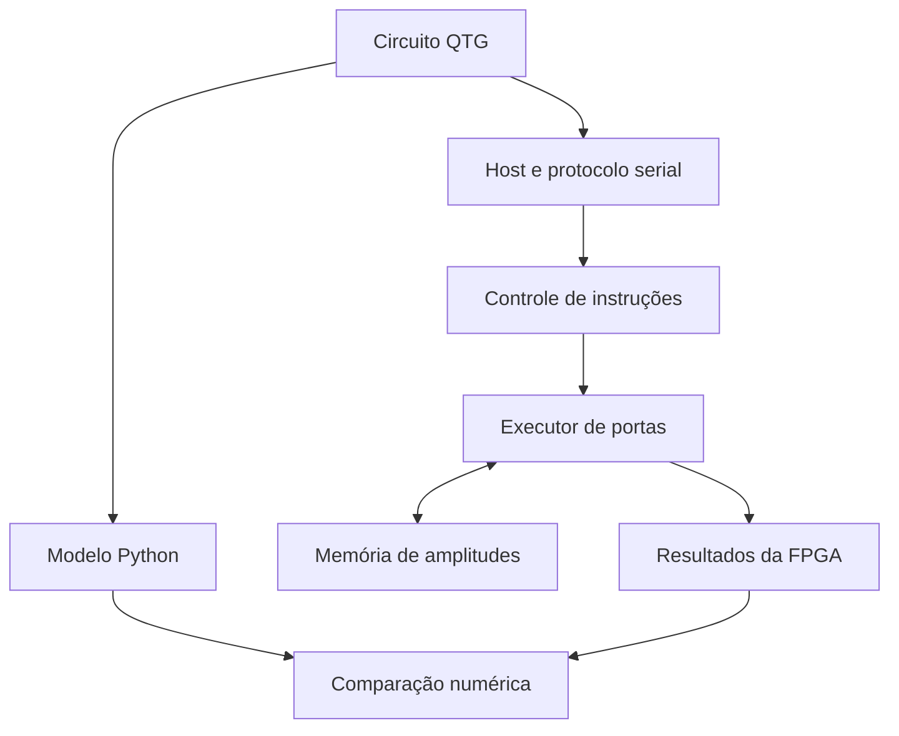

# Arquitetura proposta

**Estado: arquitetura de evolução. O [primeiro núcleo RTL](../hardware/README.md) de dois qubits já foi implementado e simulado; integração da placa pendente.**

## Uma decisão para aprender melhor

Separaremos a matemática, o executor e a placa. O mesmo circuito pequeno deverá ser comparável no modelo Python, no simulador RTL e na Tang Nano 20K. Um erro de endereçamento não deve ficar escondido atrás da comunicação serial.

O parser textual ficará no computador. A FPGA receberá comandos binários simples; formato de pacote, checksum, timeout e respostas serão definidos e testados antes da integração. Não fixamos um protocolo ainda.

## Módulos previstos

| Módulo | Responsabilidade | Primeira evidência esperada |
|---|---|---|
| `state_memory` | Armazenar componentes reais e imaginárias | Inicialização e leitura por endereço |
| `pair_address` | Enumerar pares para uma porta de um qubit | Todos os pares visitados uma única vez |
| `gate_engine` | Aplicar H, X, Z e CNOT | Comparação com vetores analíticos |
| `controller` | Sequenciar leitura, cálculo e escrita | Sem sobrescrever operandos ainda necessários |
| `uart_transport` | Receber e transmitir comandos | Loopback e rejeição de pacote inválido |
| `board_top` | Clock, reset e conexões da placa | Teste físico documentado |

## Representação numérica

Proposta inicial: cada componente é um inteiro com sinal de 16 bits, interpretado como inteiro/16384. Há 14 bits fracionários e faixa de −2 a aproximadamente +2. Assim, +1 e −1 são representáveis exatamente. Evitamos a ambiguidade de nomes de formatos Q explicitando a escala.

Uma amplitude ocupa 32 bits: 16 reais e 16 imaginários. H exige somas em largura ampliada e multiplicação pela aproximação de 1/√2. A regra de arredondamento deverá ser única e documentada; overflow deve gerar indicação de erro, não wrap silencioso. Não usaremos renormalização automática para esconder deriva numérica.

O modelo ideal usa ponto flutuante. O modelo adicional `software/fixed_reference.py` implementa o contrato inteiro do núcleo: arredondamento ao mais próximo com empates afastados de zero e rejeição atômica em caso de overflow. Consulte a documentação de hardware para a interface implementada.

## Memória estimada

| Qubits | Amplitudes | Um vetor com 4 bytes por amplitude |
|---|---:|---:|
| 2 | 4 | 16 bytes |
| 8 | 256 | 1 KiB |
| 12 | 4.096 | 16 KiB |
| 14 | 16.384 | 64 KiB |
| 20 | 1.048.576 | 4 MiB |

Esses valores excluem buffers, alinhamento e controle. Usaremos BSRAM primeiro. A SDRAM é uma expansão futura: sua capacidade isolada não garante frequência, desempenho ou roteamento bem-sucedido.

A documentação da Sipeed informa 20.736 LUT4, 828 Kbits de BSRAM, 64 Mbits de SDRAM e 48 multiplicadores 18×18. Confirmar revisão da placa, dispositivo selecionado e pinagem antes de gerar constraints. Fonte: [Sipeed](07-referencias.md).

## Limites deliberados

O primeiro núcleo executará uma porta de cada vez. Não há objetivo inicial de superar CPU ou GPU. Não faremos Shor geral no primeiro ciclo: Grover de dois qubits é uma meta educativa mais delimitada. Teletransporte exige medição intermediária, renormalização e controle clássico, que terão uma fase própria.
